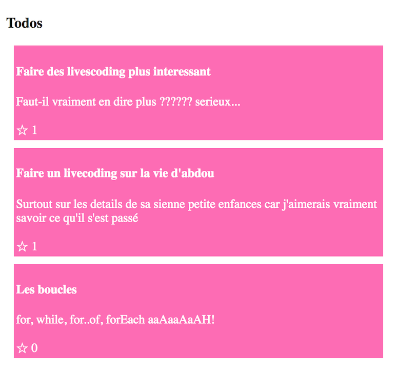

## ctoupabo

Clone the `todos` project & checkout to the dojo branch

```
git clone https://github.com/akabab/todos.git

git checkout dojo-ctoupabo
```

> Who did code this sh** ?

Make it work

### expected


#### tips

Run the server
```
node server
```

Serve the client
```
http-server client
```

---

[answers](https://github.com/akabab/todos/commit/785ac8ae067597c0ffe822a02244e44f20fe08fe?diff=split)
